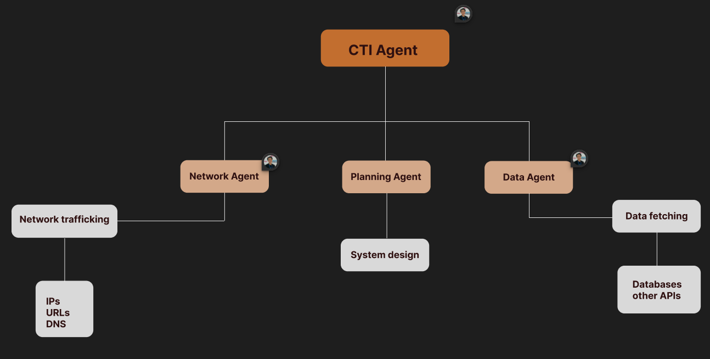

# Cyber Threat Intelligence (CTI Agent)
A comprehensive multi-agent CTI model designed to support decision-making of a SOC. Each agent includes tools for scanning and generating reports on cyber threats. The architect is extensible, capable of identifying threat groups, their techniques and associated campaigns.

## GOOGLE-HACKATHON-2025
**Tools**: Google ADK, VirusTotal, MITRE ATT&CK

## Demo
[](https://youtu.be/IaPbNhp40DM)

## Architecture diagram


*View the full design in [Figma](https://www.figma.com/design/LYqo4ivVCCmY4kaLMKqpOW/CTI-Agent?node-id=0-1&m=dev&t=jgSxTC92D5r9DVEh-1)*

## Details
```bash
# Activate virtual environment
source venv/bin/activate

# Install dependencies
python3 -m pip install -r requirements.txt

# Environment settings
cp .env.example .env

# After .env settings
adk web
```

## Example Usage
```python
# Scan a suspicious URL
agent.scanURL("https://suspicious-site.com")

# Get threat intelligence
agent.get_threat_intelligence("group")

# Analyse IP address
agent.getIP("192.168.1.100")
```

## Technical Challenges & Solutions

### Challenges Faced:
- **Model Limitations**: Utilising Gemini 1.5 Pro with function calling constraints
- **Response Optimisation**: Model tends to be concise instead of providing detailed tool-calling responses
- **Tool Integration**: Built-in tools cannot run alongside custom tools - agents need to be wrapped as tools
- **Performance**: Database access consumes significant time - implemented separate functions for efficiency
- **Context Management**: Model context, description, and instructions need to be robust and comprehensive

### Solutions Implemented:
- **Multi-Agent Architecture**: Separated concerns across specialized agents
- **Tool Wrapping**: Successfully wrapped planning agent as a tool for seamless integration
- **Optimised Functions**: Implemented efficient database access patterns
- **Robust Instructions**: Developed comprehensive agent descriptions and instructions

## Roadmap
- [ ] Integration with additional threat feeds
- [ ] Machine learning-based threat prediction
- [ ] Real-time alerting system
- [ ] Mobile application
- [ ] Advanced visualization dashboard